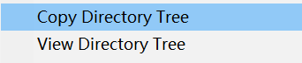
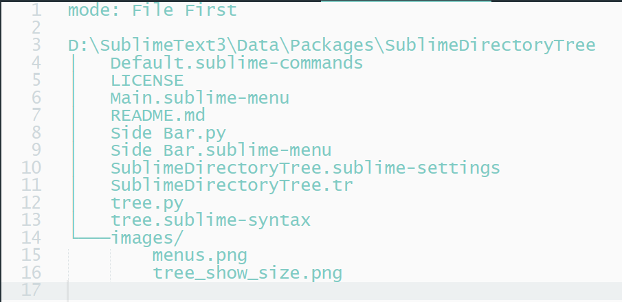
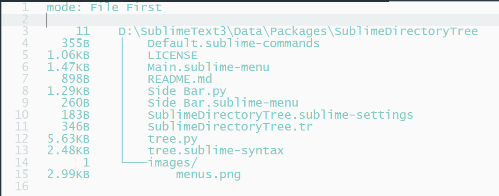

# SublimeDirectoryTree
A directory tree plugin for Sublime Text 3.

## 2 Side bar menus

- `Copy Directory Tree` will save the tree structure of that directory to clipborad.
- `Make Directory Tree` will show the tree structure of that directory in a new view.

## 4 modes
- `df`, Directory First
- `do`, Directory Only
- `ff`, File First
- `od`, Ordered

Default to be `ff`.

## Other Settings
- `sparse`, make the directory tree sparse or not.
- `indent`, number of blank that files and folders will be indented.
- `show_hidden`, list hidden files (file name starts with `.`) or not.
- `dir_tail_character`, a character that to be append on the directory name, can be empty string.

## Examples
- No show size

- show size

## TODO
- [x] list `file size` and `number of files in a directory` in left, as a optional feature.
- [ ] add `syntax highlighting` for directory trees.
